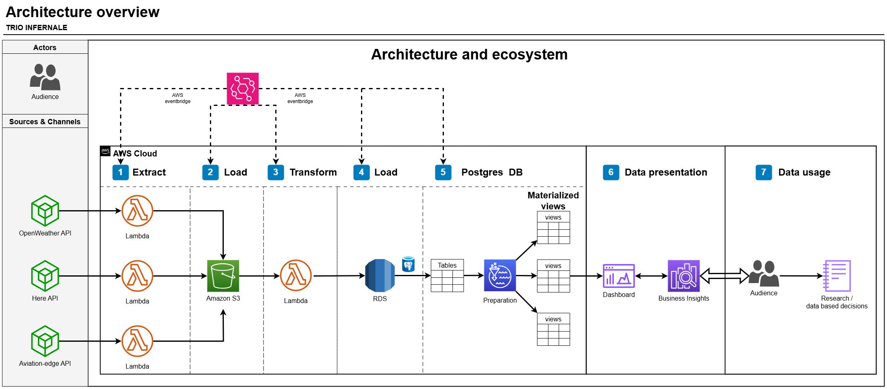
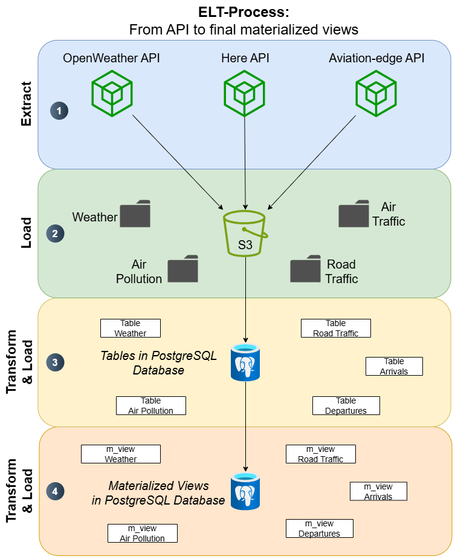
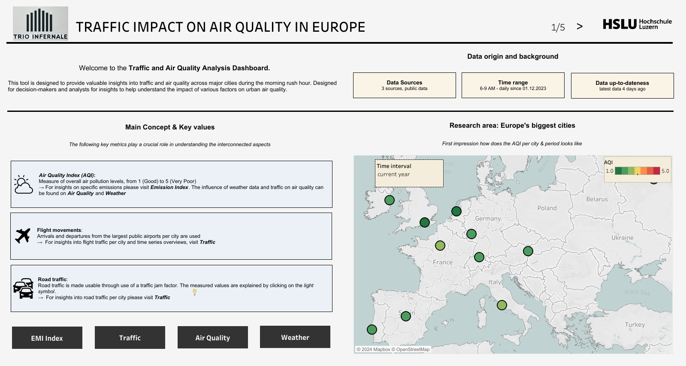
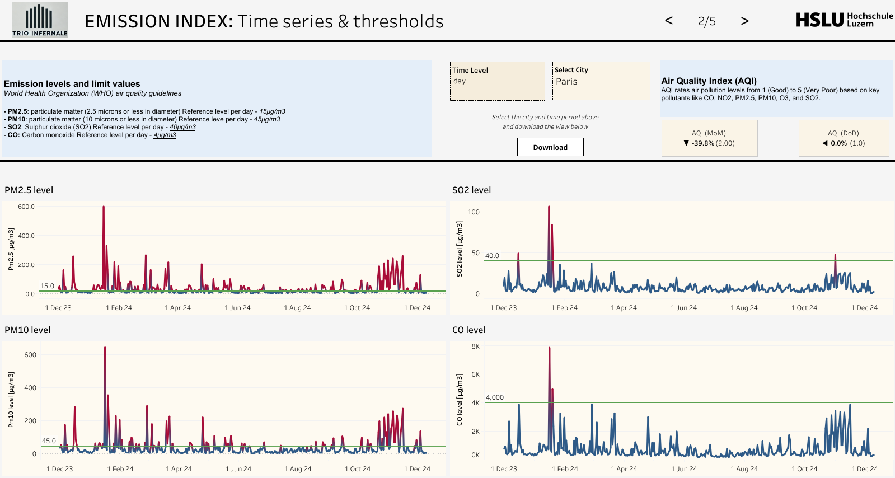
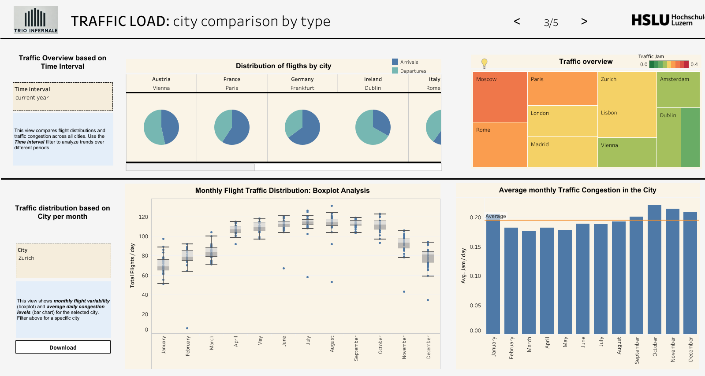
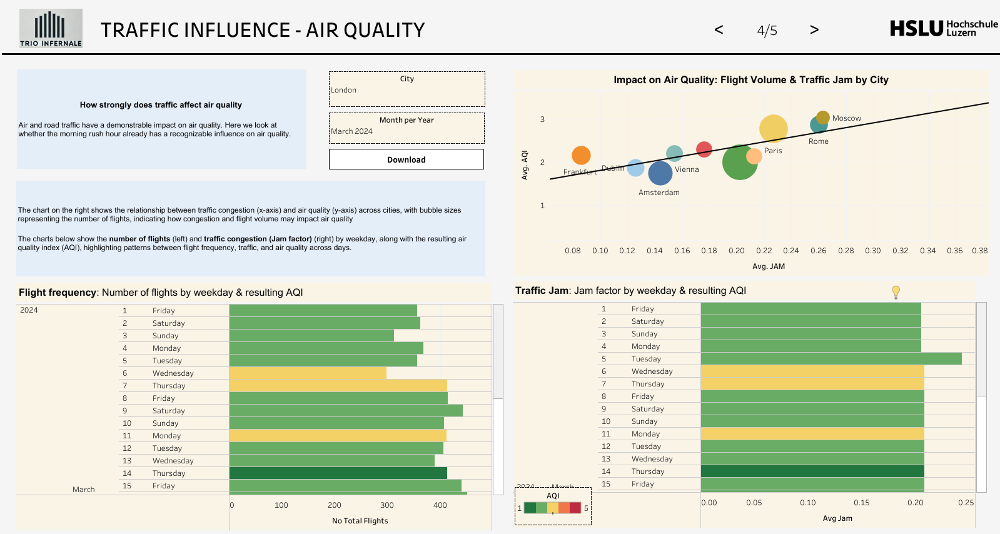
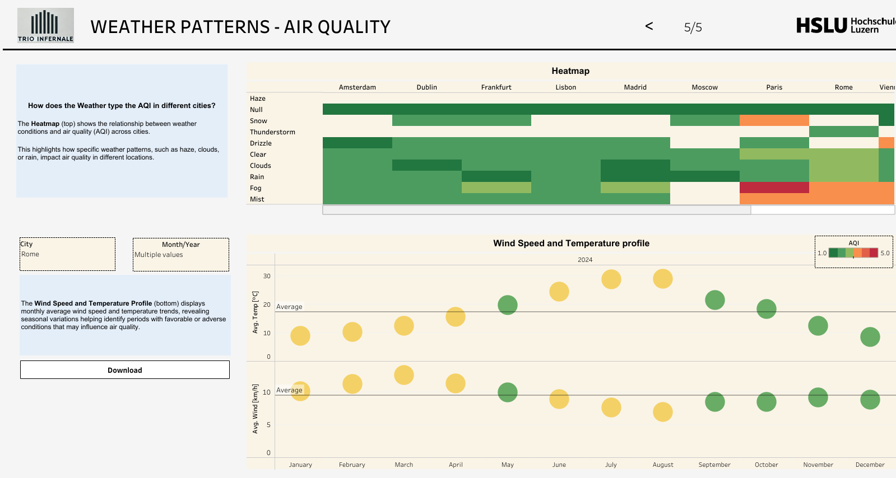

<!-- This Readme file is based on the template found here: https://github.com/othneildrew/Best-README-Template/blob/main/BLANK_README.md  -->

<!-- PROJECT SHIELDS -->
[![Contributors][contributors-shield]][contributors-url]
[![project_license][license-shield]][license-url]

<!-- PROJECT LOGO -->
 

  

## Analysis of Road Traffic, Air Traffic & Weather Conditions on Air Quality around Airports

This project focuses on analyzing the impact of road traffic, air traffic, and weather conditions on air quality around major European airports. Using data from multiple APIs ([OpenWeather][openweather-url], [HERE Traffic][here-url], and [Aviation Edge][aviationedge-url]), the project developed a robust data pipeline and warehouse architecture within [AWS][aws-url]. The solution integrates raw data, processes it through transformation layers, and stores it in [PostgreSQL][postgresql-url], enabling efficient querying and analysis. Interactive dashboards in [Tableau][tableau-url] provide stakeholders with actionable insights for policy-making, environmental planning, and advocacy, offering a comprehensive view of the relationships between transportation patterns and air quality: [Tableau Dashboard][tableau-dashboard].

<!-- TABLE OF CONTENTS -->

  
Table of Contents

  <ol>
    <li>
      <a href="#about-the-project">About The Project</a>
      <ul>
        <li><a href="#project-idea">Project Idea</a></li>
        <li><a href="#built-with">Built With</a></li>
      </ul>
    </li>
    <li><a href="#data-sources">Data Sources</a></li>
    <li>
      <a href="#architecture">Architecture</a>
      <ul>
        <li><a href="#data-lake">Data Lake</a></li>
        <li><a href="#data-warehouse">Data Warehouse</a></li>
        <li><a href="#business-intelligence">Business Intelligence</a></li>
      </ul>
    </li>
    <li><a href="#usage examples">Usage</a></li>
    <li><a href="#contact">Contact</a></li>
    <li><a href="#challenges-and-lessons-learned">Challenges and Lessons Learned</a></li>
    <li><a href="#acknowledgments">Acknowledgments</a></li>
  </ol>

<!-- ABOUT THE PROJECT -->
## About The Project

This project was created by the project group, consisting of three students, as part of a semester project for the Msc Applied Information & Data Science course in the Data Lake and Data Warehouse Systems module at the Lucerne University of Applied Sciences.

### Project idea

This project focuses on building a scalable data infrastructure integrating an [AWS S3][aws-url] Data Lake and a [PostgreSQL][postgresql-url] Data Warehouse. Automated ELT pipelines extract, load, and transform data from APIs, preparing it for analysis. Materialized views aggregate data for efficient querying and visualization in [Tableau][tableau-url], enabling interactive dashboards for Business Intelligence and decision-making.

### Built With

* [![AWS][aws-shield]][aws-url]
* [![PostgreSQL][postgresql-shield]][postgresql-url]
* [![Tableau][tableau-shield]][tableau-url]
* [![Docker][docker-shield]][docker-url]

<!-- Data Scources -->
### Used Services

The project utilizes data from the following providers:  
- [Aviation Edge][aviationedge-url]: Air traffic data for flight arrivals and departures.  
- [OpenWeather][openweather-url]: Weather and air quality data for environmental analysis.  
- [HERE Technologies][here-url]: Real-time road traffic data for congestion and flow patterns.  

(<a href="#readme-top">back to top</a>)

<!-- Setup & Architectur -->
## Architecture

The architecture for this project is divided into three main components, which are designed to enable seamless processing and analysis of data from different sources: Data Lake, Data Warehouse and Business Intelligence.
In the first two parts, the process follows an ELT approach, which extracts the data, loads it into the data lake and transforms the data so that it can be used for business intelligence purposes.

### Data Lake
The **Data Lake** serves as a central repository for raw data collected from multiple APIs, organized in a scalable and structured manner. The following process illustrates the procedure:

- **Storage**: Data is stored in an [AWS S3][aws-url] bucket with subfolders organized by data source (e.g., aviation, weather, traffic).
- **Purpose**: Acts as a staging area for raw data to enable further transformations and ensure traceability.
- **Structure**: Logical folder organization (e.g., by date and city) ensures efficient access and management.

### Data Warehouse
The **Data Warehouse** is built using a [PostgreSQL][postgresql-url] database on [AWS RDS][aws-url] to enable efficient querying and analytics:
- **Raw Tables**: Data from the Data Lake is loaded into structured raw tables, retaining as much original information as possible for traceability and flexibility.
- **Materialized Views**: Aggregated daily-level data is prepared for visualization in [Tableau][tableau-url], optimizing query performance.
- **Automation**: Data transformations and updates are orchestrated using [AWS Lambda][aws-url] and EventBridge, ensuring up-to-date and reliable data pipelines.

### Business Intelligence
The **Business Intelligence** layer visualizes the processed data to provide actionable insights:
- **Tool**: [Tableau][tableau-url] dashboards directly query the Materialized Views in the [PostgreSQL][postgresql-url] database.
- **Focus**: Dashboards highlight relationships between air quality, weather, and traffic data, enabling stakeholders to explore patterns and correlations.
- **Outcomes**: Interactive visualizations provide clear and accessible insights for data-driven decision-making.

(<a href="#readme-top">back to top</a>)

<!-- USAGE EXAMPLES -->
## Usage

This project provides interactive visualizations to explore the impact of road traffic, air traffic, and weather conditions on air quality. The dashboards are published on Tableau Public and are accessible via the link below:

  
View Screenshots

  [View the Tableau Public Dashboard](tableau-dashboard)
  

### Screenshots of Dashboards:
#### 1. Overview Dashboard
The first page introduces the project by highlighting the topic and research area while giving users general information about the data sources, timeframes and key metrics. 

#### 2. Emission Index Dashboard
This page focuses on detailed insights into various emissions and their trends across cities. It allows stakeholders to analyze emission patterns and their variations over time, contributing to a better understanding of air quality factors.

#### 3. Traffic Dashboard
This page examines traffic data in detail, presenting patterns for specific locations. 

#### 3. Traffic ~ Air Quality Dashboard
This dashboard explores the relationship between traffic (road and flight) and air quality. It combines data to demonstrate how changes in traffic intensity correlate with fluctuations in air quality, providing actionable insights.

#### 3. Weather ~ Air Quality Dashboard
This page investigates the role of weather conditions on air quality, presenting correlations between weather parameters (e.g. temperature, wind speed, weather types) and air pollution levels. It helps contextualize how environmental factors mitigate or exacerbate pollution.

(<a href="#readme-top">back to top</a>)

<!-- challenges-and-lessons-learned -->
## Challenges and lessons learned

- **Integration of Multiple Data Sources**  
  Successfully combined data from multiple APIs into a unified data warehouse, but reliance on external APIs posed challenges like data delays and inconsistencies.

- **Storage Trade-Offs**  
  Maintaining both raw and transformed data increased storage demand, ensuring traceability but requiring better long-term capacity planning for scalability.

- **Materialized Views**  
  Enhanced query efficiency and BI dashboard performance but added operational complexity in managing updates and ensuring data synchronization.

- **Limited Observation Period**  
  The focus on morning hours (6-9 AM) provided valuable insights but limited the analysis scope. Expanding the timeframe could yield a more comprehensive understanding of traffic and weather impacts.

- **Dependence on AWS Lambda**  
  Heavy reliance on AWS Lambda for automation highlighted potential risks in dependency. Exploring alternatives like AWS Glue or Apache Airflow could enhance system resilience and scalability.

- **Complex Visualizations**  
  Visual elements like regression lines and WHO limit values were insightful but potentially overwhelming for non-technical users. Providing separate documentation and simplifying dashboard text could improve user experience and accessibility.

(<a href="#readme-top">back to top</a>)

## Contact

**Contributors:**

- **Lukas Aebi**  
  [LinkedIn][linkedin-url-user1] | [GitHub][github-url-user1]

- **Tim Zoller**  
  [LinkedIn][linkedin-url-user2] | [GitHub][github-url-user2]

- **Carlo Scherrer**  
  [LinkedIn][linkedin-url-user3] | [GitHub][github-url-user3]

Project Link: [Data Warehouse Data Lake Project][repo-url]

(<a href="#readme-top">back to top</a>)

<!-- ACKNOWLEDGMENTS -->
## Acknowledgments

We would like to express our gratitude to the following organizations and individuals who supported this project:

* [Aviation Edge](aviationedge-url) for providing free API access during the project duration, which greatly facilitated our analysis of aviation traffic data.
* Our university, [Hochschule Luzern], especially our lecturers for their guidance and support throughout the project.
* [AWS Educate](https://aws.amazon.com/) for offering free student accounts, enabling us to implement a scalable cloud infrastructure for the data pipeline and storage.

(<a href="#readme-top">back to top</a>)

<!-- MARKDOWN LINKS & IMAGES -->
[contributors-shield]: https://img.shields.io/github/contributors/github_username/repo_name.svg?style=for-the-badge
[contributors-url]: https://github.com/lukasaebi/data-warehouse-data-lake-project/graphs/contributors
[license-shield]: https://img.shields.io/github/license/github_username/repo_name.svg?style=for-the-badge
[license-url]: https://github.com/github_username/repo_name/blob/master/LICENSE.txt
[linkedin-shield-user1]: https://img.shields.io/badge/-LinkedIn-blue.svg?style=for-the-badge&logo=linkedin&colorB=555
[linkedin-url-user1]: https://www.linkedin.com/in/user1
[github-url-user1]: https://github.com/lukasaebi
[linkedin-shield-user2]: https://img.shields.io/badge/-LinkedIn-blue.svg?style=for-the-badge&logo=linkedin&colorB=555
[linkedin-url-user2]: https://www.linkedin.com/in/user2
[github-url-user2]: https://github.com/timzoller
[linkedin-shield-user3]: https://img.shields.io/badge/-LinkedIn-blue.svg?style=for-the-badge&logo=linkedin&colorB=555
[linkedin-url-user3]: https://www.linkedin.com/in/carlo-scherrer-562b35225
[Hochschule Luzern]: https://www.hslu.ch/de-ch/wirtschaft/studium/master/applied-information-and-data-science/
[github-url-user3]: https://github.com/Carlomk1
[repo-url]: https://github.com/lukasaebi/data-warehouse-data-lake-project
[aws-shield]: https://img.shields.io/badge/AWS-orange.svg?style=for-the-badge
[aws-url]: https://aws.amazon.com/
[postgresql-shield]: https://img.shields.io/badge/PostgreSQL-blue.svg?style=for-the-badge
[postgresql-url]: https://www.postgresql.org/
[tableau-shield]: https://img.shields.io/badge/Tableau-lightblue.svg?style=for-the-badge
[tableau-url]: https://www.tableau.com/
[aviationedge-url]: https://aviation-edge.com/
[openweather-url]: https://openweathermap.org/
[here-url]: https://www.here.com/
[tableau-dashboard]: https://public.tableau.com/views/AirPollution_analysis_TrioInfernale/Overview?:language=en-US&publish=yes&:sid=&:redirect=auth&:display_count=n&:origin=viz_share_link
[docker-shield]: https://img.shields.io/badge/Docker-blue.svg?style=for-the-badge&logo=docker&logoColor=white
[docker-url]: https://www.docker.com/
